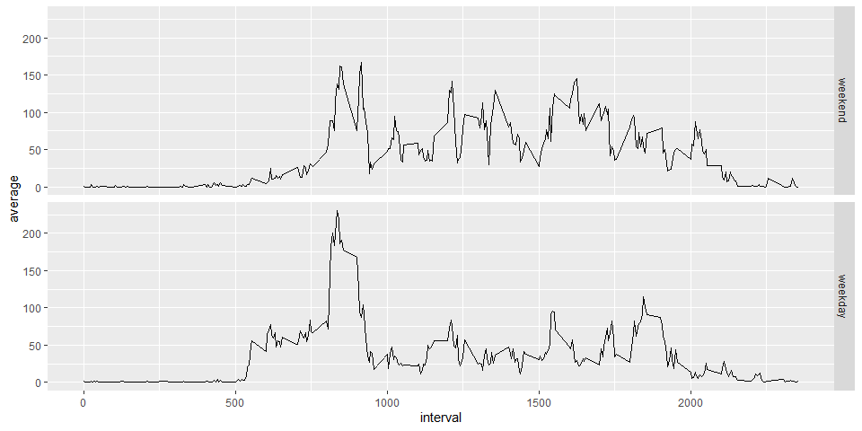

## Loading and preprocessing the data

Reading the data into activity data frame and show some summary statistics


```r
activity = read.csv("activity.csv")
```

Processing the Data


```r
activity$day <- weekdays(as.Date(activity$date))
activity$DateTime<- as.POSIXct(activity$date, format="%Y-%m-%d")
require(dplyr)
total_day <- activity %>% group_by(date) %>%summarise(total_steps=sum(steps,na.rm=TRUE),na=mean(is.na(steps))) %>% print
```

```
## # A tibble: 61 x 3
##    date       total_steps    na
##    <chr>            <int> <dbl>
##  1 2012-10-01           0     1
##  2 2012-10-02         126     0
##  3 2012-10-03       11352     0
##  4 2012-10-04       12116     0
##  5 2012-10-05       13294     0
##  6 2012-10-06       15420     0
##  7 2012-10-07       11015     0
##  8 2012-10-08           0     1
##  9 2012-10-09       12811     0
## 10 2012-10-10        9900     0
## # ... with 51 more rows
```

```r
clean <- activity[!is.na(activity$steps),]
```


## What is mean total number of steps taken per day?


```r
sumTable <- aggregate(activity$steps ~ activity$date, FUN=sum, )
colnames(sumTable)<- c("Date", "Steps")
```

Make a histogram of the total number of steps taken each day


```r
hist(sumTable$Steps, breaks=5, xlab="Steps", main = "Total Steps per Day")
```

<!-- -->

Calculate and report the mean and median of the total number of steps taken per day


```r
mean_steps <- as.integer(mean(sumTable$Steps))
mean_steps
```

```
## [1] 10766
```

```r
median_steps <- as.integer(median(sumTable$Steps))
median_steps
```

```
## [1] 10765
```

The average number of steps taken each day was **10766** steps.
The median number of steps taken each day was **10765** steps.

## What is the average daily activity pattern?

Make a time series plot (i.e. type = "l") of the 5-minute interval (x-axis) and the average number of steps taken, averaged across all days (y-axis)  


```r
library(dplyr,quietly = TRUE)
daily_patterns <- activity %>% group_by(interval) %>% summarise(average=mean(steps,na.rm=TRUE))
plot(x = 1:nrow(daily_patterns),y = daily_patterns$average,type = "l",
     col = "red", xaxt = "n",xlab="Intervals", 
     ylab = "Average for given interval across all days")
axis(1,labels=daily_patterns$interval[seq(1,288,12)],
     at = seq_along(daily_patterns$interval)[seq(1,288,12)])
```

<!-- -->

Which 5-minute interval, on average across all the days in the dataset, contains the maximum number of steps?


```r
max_numb_steps_interval <- filter(daily_patterns,average==max(average))
```

Interval **835** contains on average the maximum number of steps (**206.17 steps**).

## Imputing missing values

Calculate and report the total number of missing values in the dataset (i.e. the total number of rows with NAs)


```r
na_number <- sum(is.na(activity$steps))
na_number
```

```
## [1] 2304
```

```r
percentage_na <- mean(is.na(activity$steps))
percentage_na
```

```
## [1] 0.1311475
```

Total number of missing values in the dataset amounts to **2304 ** (what is **13.1** % of total observations).

Devise a strategy for filling in all of the missing values in the dataset

My strategy for filling in NAs will be to substitute the missing steps with the average 5-minute interval based on the day of the week.

Create a new dataset that is equal to the original dataset but with the missing data filled in.

```r
without_NAs <- numeric(nrow(activity))
for (i in 1:nrow(activity))
{
        if (is.na(activity[i,"steps"])==TRUE)
            {
                    without_NAs[i]<-filter(daily_patterns,interval==activity[i,"interval"]) %>% select(average)
            } 
        else
            {
                    without_NAs[i]<-activity[i,"steps"]
            }
                    
}
activity_without_NAs<-mutate(activity,steps_no_NAs=without_NAs)
```

Below code is just to verify if process of imputing missing values correctly preserved original values (lines with no NAs)   

```r
check <- filter(activity_without_NAs,!is.na(steps)) %>% mutate(ok = (steps==steps_no_NAs))
mean(check$ok)
```

```
## [1] 1
```
Make a histogram of the total number of steps taken each day and Calculate and report the mean and median total number of steps taken per day


```r
total_day_noNAs <- activity_without_NAs %>% mutate(steps_no_NAs=as.numeric(steps_no_NAs)) %>% group_by(date) %>% summarise(total_steps=sum(steps_no_NAs))
hist(total_day_noNAs$total_steps,col="blue",breaks=20,main="Total steps per day",xlab="Steps per day")
abline(v=median(total_day$total_steps),lty=3, lwd=2, col="black")
legend(legend="median","topright",lty=3,lwd=2,bty = "n")
```

<!-- -->


```r
summary(total_day_noNAs$total_steps)
```

```
##    Min. 1st Qu.  Median    Mean 3rd Qu.    Max. 
##      41    9819   10766   10766   12811   21194
```

## Are there differences in activity patterns between weekdays and weekends?

Create a new factor variable in the dataset with two levels – “weekday” and “weekend” indicating whether a given date is a weekday or weekend day


```r
library(lubridate)
```

```
## 
## Attaching package: 'lubridate'
```

```
## The following objects are masked from 'package:base':
## 
##     date, intersect, setdiff, union
```

```r
is_weekday <-function(date){
        if(wday(date)%in%c(1,7)) result<-"weekend"
        else
                result<-"weekday"
        result
}
activity_without_NAs <- mutate(activity_without_NAs,date=ymd(date)) %>% mutate(day=sapply(date,is_weekday))
table(activity_without_NAs$day)
```

```
## 
## weekday weekend 
##   12960    4608
```

Make a panel plot containing a time series plot (i.e. type = "l") of the 5-minute interval (x-axis) and the average number of steps taken, averaged across all weekday days or weekend days (y-axis)


```r
library(ggplot2)
daily_patterns <- activity_without_NAs %>% mutate(day=factor(day,levels=c("weekend","weekday")),steps_no_NAs=as.numeric(steps_no_NAs)) %>% group_by(interval,day) %>% summarise(average=mean(steps_no_NAs))
```

```
## `summarise()` has grouped output by 'interval'. You can override using the `.groups` argument.
```

```r
qplot(interval,average,data=daily_patterns,geom="line",facets=day~.)
```

<!-- -->
